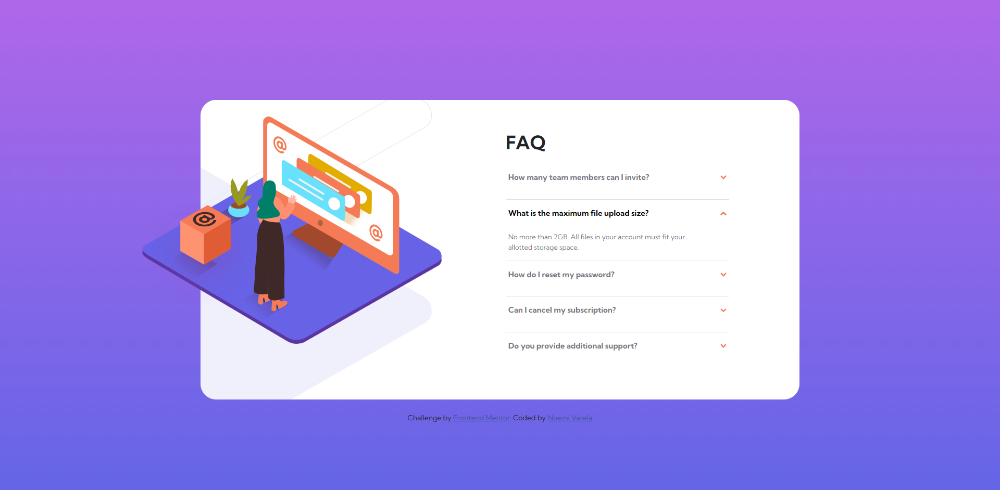
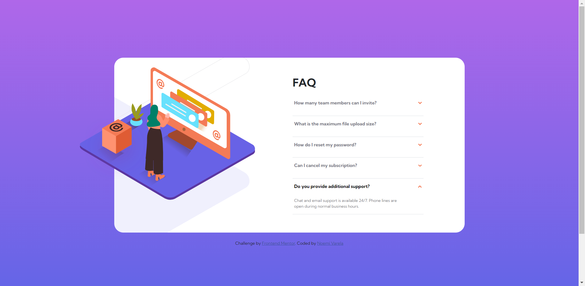
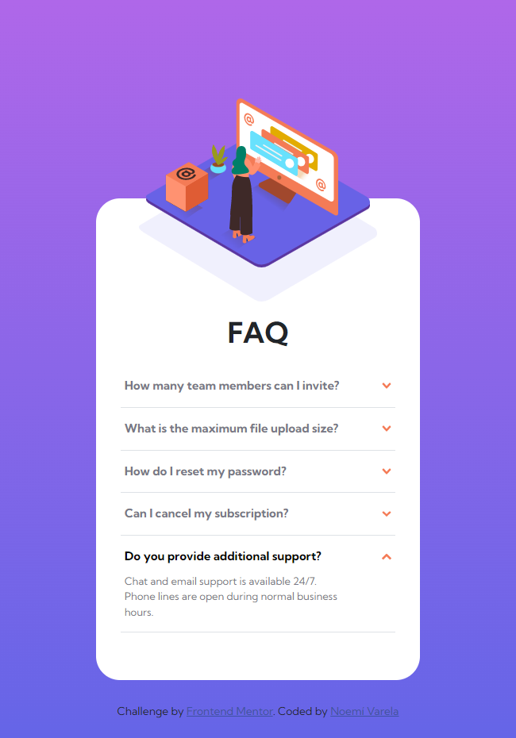

# Frontend Mentor - FAQ accordion card solution

This is a solution to the [FAQ accordion card challenge on Frontend Mentor](https://www.frontendmentor.io/challenges/faq-accordion-card-XlyjD0Oam). Frontend Mentor challenges help you improve your coding skills by building realistic projects. 

## Table of contents

- [Overview](#overview)
  - [The challenge](#the-challenge)
  - [Screenshot Desktop States](#screenshot-desktop-states)
  - [Screenshot Desktop](#screenshot-desktop)
  - [Screenshot Mobile](#screenshot-mobile)
  - [Links](#links)
- [My process](#my-process)
  - [Built with](#built-with)
  - [What I learned](#what-i-learned)
- [Author](#author)
- [Acknowledgments](#acknowledgments)

## Overview

### The challenge

Users should be able to:

- View the optimal layout for the component depending on their device's screen size
- See hover states for all interactive elements on the page
- Hide/Show the answer to a question when the question is clicked

### Screenshot Desktop States

### Screenshot Desktop

### Screenshot Mobile

### Links

- Solution URL: [https://github.com/noemivarela1/faq-accordion-card-main](https://github.com/noemivarela1/faq-accordion-card-main)
- Live Site URL: [https://noemivarela1.github.io/faq-accordion-card-main/](https://noemivarela1.github.io/faq-accordion-card-main/)

## My process

### Built with

- Semantic HTML5 markup
- CSS custom properties
- Flexbox
- Mobile-first workflow
- Bootstrap
- No JavaScript

### What I learned

Create custom accordions without JavaScript

## Author

- Frontend Mentor - [@noemivarela1](https://www.frontendmentor.io/profile/noemivarela1)

